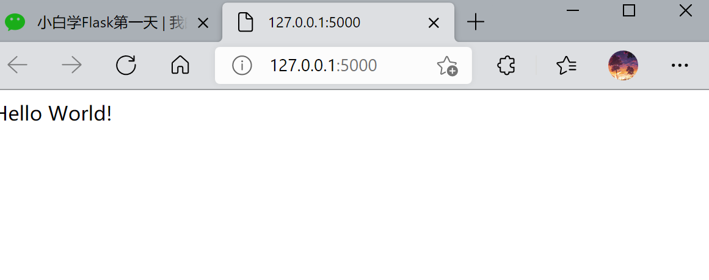

## 第一个Flask程序


### 1. 认识Flask

***

**Flask是一个Web框架，它的作用主要是为了开发Web应用程序**，Web大家应该都了解，就是网页。所以说我们学完了Flask就可以自己写个小网站了。

Flask是一个**轻量级的框架**，它不像Django那么的重量级(大家自行百度Django)，但是不管是轻量级还是重量级都有它们各自的优缺点，我们即将学习的Flask就有着**自由、灵活、高度定制的优点。**

Flask本身相当于一个内核，其他几乎所有的功能都要用到扩展（邮件扩展Flask-Mail，用户认证Flask-Login），都需要用第三方的扩展来实现。比如可以用Flask-extension加入ORM、窗体验证工具，文件上传、身份验证等。Flask没有默认使用的数据库，你可以选择MySQL，也可以用NoSQL。其 WSGI 工具箱采用 Werkzeug（路由模块） ，模板引擎则使用 Jinja2 。

可以说Flask框架的核心就是Werkzeug和Jinja2。

Python最出名的框架要数Django，此外还有Flask、Tornado等框架。虽然Flask不是最出名的框架，但是Flask应该算是最灵活的框架之一，这也是Flask受到广大开发者喜爱的原因。


Flask本身，Flask框架提供了很多的扩展包给我们开发者：


- **Flask-SQLalchemy：****操作数据库；**
- **Flask-migrate：****管理迁移数据库；**
- **Flask-Mail:邮件；**
- **Flask-WTF：****表单；**
- **Flask-script：****插入脚本；**
- **Flask-Login：****认证用户状态；**
- **Flask-RESTful：****开发REST API的工具；**
- **Flask-Bootstrap：****集成前端Twitter Bootstrap框架；**
- **Flask-Moment：****本地化日期和时间；**


这里还提供Flask的官方文档：


**中文文档：** **http://docs.jinkan.org/docs/flask/**

**英文文档：** **http://flask.pocoo.org/docs/0.11/**

### 2.第一个Flask程序

***

进入pycharm,新建第一个flask项目


创建第一个flask项目

```python


from flask import Flask


# 创建Flask的应用对象
app = Flask(__name__)    # __name__ 就是当前模块的名字

# 装饰器，绑定视图函数的路径
@app.route('/')
def hello_world():
    # 视图函数
    return 'Hello World!'


if __name__ == '__main__':
    # 运行本地服务器进行测试flask程序
    app.run()
```


**衔接：**

第一部分

```
app = Flask(__name__)    # __name__ 就是当前模块的名
```

在注释中，我也写了__name__表示当前模板的名字，那么我们传这个参数进去的意义何在？其实当我们传进我们当前模板名字之后，Flask就会默认当前模板所在的目录为整个项目的总目录，static为该项目的静态文件目录，templates为当前项目的模板目录。


再看

```

# 装饰器，绑定视图函数的路径
@app.route('/')
def hello_world():
    # 视图函数
    return 'Hello World!'
```

这是我们所写的一个视图函数，这里可以处理前端返回给我们的数据，由于我们刚入门，所以这里我们直接返回一个`Hello World! `

最后

```
if __name__ == '__main__':
    # 运行本地服务器进行测试flask程序
    app.run()
```

app.run() 我们运行这一句话时，Flask会启动一个web服务器来运行我们的程序


运行程序之后：


浏览器：

