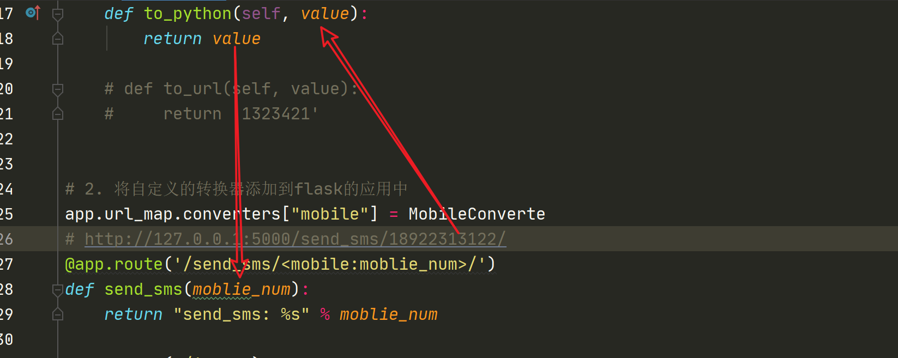

## 路由转换器进阶使用

 

### 自定义转换器实例

***

```
# -*- coding: utf-8 -*-
from flask import Flask,redirect,url_for
from werkzeug.routing import BaseConverter
app = Flask(__name__)

class MobileConverte(BaseConverter):
    def __init__(self,url_map):
        # 调用父类的初始化方法
        super(MobileConverte, self).__init__(url_map)
        self.regex = r'1[345678]\d{9}'

    # 其实to_python这个方法才是转换器的核心，
    # 当我们转换器提取到路径上面的参数后，
    # 不是直接返回给视图函数中的参数，
    # 而是要经过to_python方法才返回给视图函数

    def to_python(self, value):
        return value

    # def to_url(self, value):
    #     return '1323421'


# 2. 将自定义的转换器添加到flask的应用中
app.url_map.converters["mobile"] = MobileConverte

@app.route('/send_sms/<mobile:moblie_num>/')
def send_sms(moblie_num):
    return "send_sms: %s" % moblie_num

@app.route("/index")
def index():
    url = url_for("send_sms", moblie_num="18922313122")
    return redirect(url)
if __name__ == '__main__':
    print(app.url_map)
    # 启动flask程序
    app.run(debug=True)
```

输出：

### to_python方法

***

```
class BaseConverter:
    """Base class for all converters."""

    regex = "[^/]+"
    weight = 100

    def __init__(self, map: "Map", *args: t.Any, **kwargs: t.Any) -> None:
        self.map = map

    def to_python(self, value: str) -> t.Any:
        return value

    def to_url(self, value: t.Any) -> str:
        if isinstance(value, (bytes, bytearray)):
            return _fast_url_quote(value)
        return _fast_url_quote(str(value).encode(self.map.charset))
```


所继承的父类BaseConverter中，有to_python和to_url两个方法，我们首先来看看to_python方法。

其实**to_python这个方法才是转换器的核心**，当我们转换器提取到路径上面的参数后，不是直接返回给视图函数中的参数，而是要经过to_python方法才返回给视图函数，我给大家画了张图可能更容易理解



举个例子


大家可以看到我把to_python方法的返回值给改成了123412，我们运行一下看看它是返回“123456”还是返回路径中所提取的参数.


### to_url

***

除了to_python方法，这个方法有什么用呢？其实to_url方法和我们之前讲的url_for方法有着很大的联系，我们可以看下下面的代码：

```

@app.route("/index")
def index():
    url = url_for("send_sms", moblie_num="1892231312")
    return redirect(url)
```


可以看到我们url_for里面有两个参数，第一则是指向我们send_sms视图函数的，后面那个则是send_sms函数中所提取电话号码的值。通过这样传值我们就可以通过url_for来调用一些有变化的参数的视图函数。

路由返回的是to_url中的数值，但因为路由不正确，所以返回一个404

