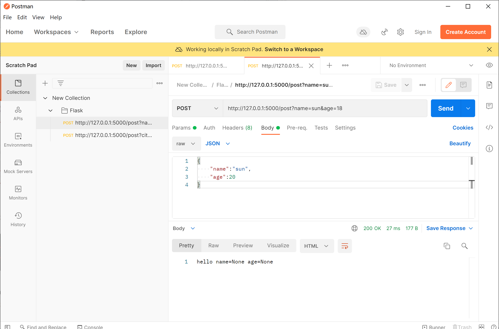

## Request对象


### 1.request的form_data_args用法

***

request常用属性：


```

# -*- coding: utf-8 -*-
from flask import Flask,request

app = Flask(__name__)

@app.route("/post", methods=["GET","POST"])
def post():
    name = request.form.get("name")
    age = request.form.get("age")
    return "hello name=%s age=%s" % (name, age)

if __name__ == '__main__':
    app.run(debug=True)
```

为了给大家演示，我这里采用的是**postman软件**，这是一款可以模拟多种请求方式的软件，扔给大家一个链接：


**https://www.getpostman.com/downloads/**


我就用这款软件来模拟post请求

以表单发送：

可以看到我们成功的请求了数据，同时也成功的获取到了表单当中的数据

如果我们去打印request中的data数据会是什么返回结果？**data是指请求体当中的数据**，我们来测试看看


```python

@app.route("/post", methods=["GET","POST"])
def post():
    name = request.form.get("name")
    age = request.form.get("age")
    print(request.data)
    return "hello name=%s age=%s" % (name, age)
```

输出结果：

可以看到返回的结果是空的，这是为什么呢？我们明明post数据到request当中了。**其实在这之前我们就已经将请求体当中的数据放到了form字典当中去了，也就是将 name=kuls&age=11 这类的数据转化成类字典的形式了，所以data当中的数据已经不存在了**

如果按照json格式数据发送过去，

返回结果：


碰到下面这种地址：

```html
http://127.0.0.1:5000/post?city=huhan
```


**这种地址称为查询字符串，在request当中也有相关的属性args**

```
@app.route("/post", methods=["GET","POST"])
def post():
    city = request.args.get("city")
    print(request.data)
    return "hello city=%s" % (city)
```


返回结果：

args的整体思路和form差不多，所以这里不过多阐述

### 2. 上传文件

***

上传文件主要用了request当中最后一个**属性files**

```

# -*- coding: utf-8 -*-
from flask import Flask,request

app = Flask(__name__)


@app.route("/upload", methods=["GET","POST"])
def upload():
    f = request.files.get("pic")
    if f is None:
        # 没有发送文件
        return "未上传文件"
    # 将文件保存在本地
    # 1.创建一个文件
    f1 = open("./demo.png", "wb")
    # 2.向文件写内容
    data = f.read()
    f1.write(data)
    f1.close()
    return "上传成功"

if __name__ == '__main__':
    app.run(debug=True)
```

我们运行代码，并且再次使用postman来进行模拟上传文件。


这里简单教大家一下如何来上传


填写headers：

Key：Content-Type

Value：multipart/form-data


最后在body当中上传


其实上传文件还有一个更简单的方法

```
@app.route("/upload", methods=["GET","POST"])
def upload():
    f = request.files.get("pic")
    if f is None:
        # 没有发送文件
        return "未上传文件"
    # 直接使用上传的文件对象保存
    f.save("./demo1.jpg")
    return "上传成功"
```

