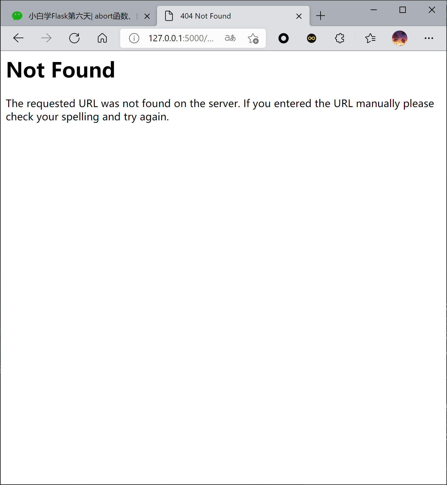
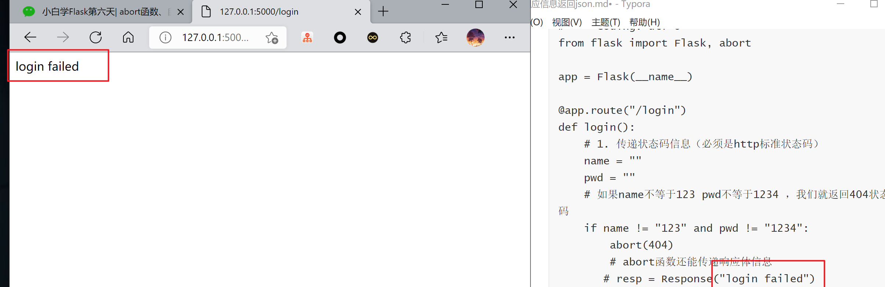
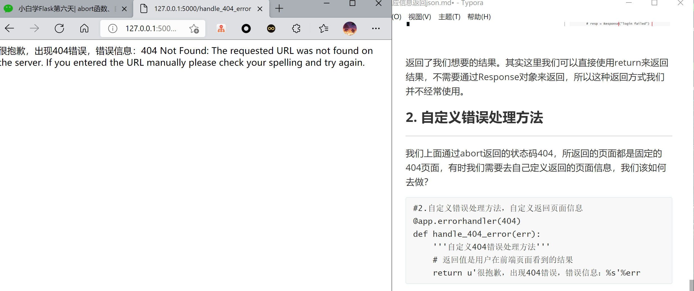
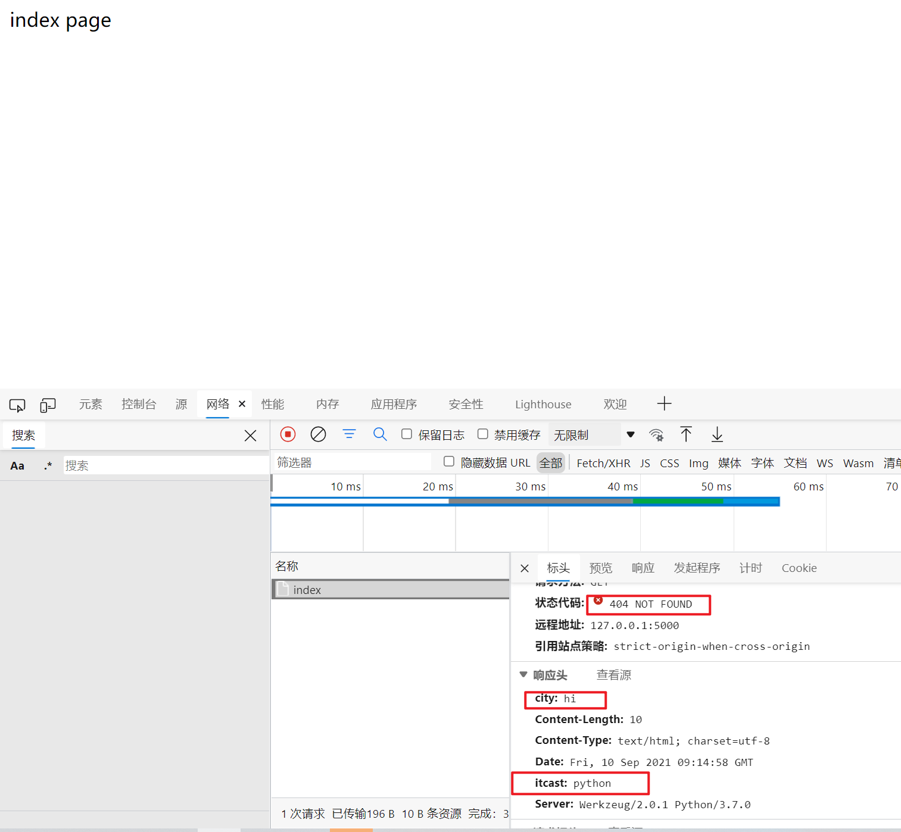
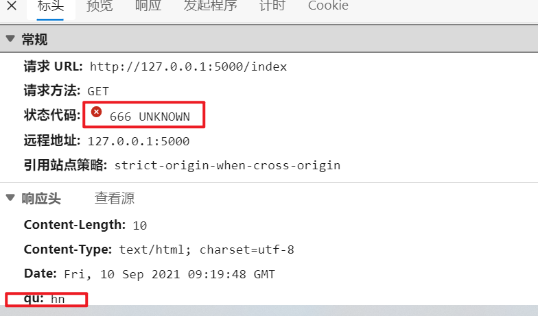
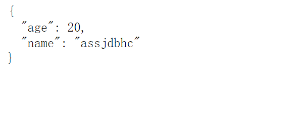

### abort函数、自定义错误方法、视图函数的返回值

****


### 1.abort函数的用法

***

 abort函数是我们又新接触的一个函数，具体有什么作用？简单点说它可以**终止视图函数的执行并且还可以返回给前端特定的信息。**

下面我将举两个特定的例子

首先第一种：**传递状态码信息（必须是http标准状态码）**

```

# -*- coding: utf-8 -*-
from flask import Flask, abort

app = Flask(__name__)

@app.route("/login")
def login():
    # 1. 传递状态码信息（必须是http标准状态码）
    name = ""
    pwd = ""
    # 如果name不等于123 pwd不等于1234 ，我们就返回404状态码
    if name != "123" and pwd != "1234":
        abort(404)
        # abort函数还能传递响应体信息
       # resp = Response("login failed")
       # abort(resp)

    return "login success"

if __name__ == '__main__':
    app.run(debug=True)
```

输出结果：




返回了我们想要的结果。其实这里我们可以直接使用return来返回结果，不需要通过Response对象来返回，所以这种返回方式我们并不经常使用。

### 2. 自定义错误处理方法

***

我们上面通过abort返回的状态码404，所返回的页面都是固定的404页面，有时我们需要去自己定义返回的页面信息，我们该如何去做？

```
#2.自定义错误处理方法，自定义返回页面信息
@app.errorhandler(404)
def handle_404_error(err):
    '''自定义404错误处理方法'''
    # 返回值是用户在前端页面看到的结果
    return u'很抱歉，出现404错误，错误信息：%s'%err
```




### 3.设置响应信息的方法

***

设置响应信息的方法有两种，我们先来讲讲第一种，**通过元组的形式，返回自定义的响应信息**

```
#3.设置响应信息方法
@app.route("/index")
def index():
    # 1. tuple
    return ('index page',404,[('itcast','python'),('city','hi')])

    # 2.dic
    return ("index page",400,{"itcast":"python","city":"wuh"})
```



**除了上面的方法去设置响应信息，我们还可以通过make_response函数来进行返回：**

```

# -*- coding: utf-8 -*-
from flask import Flask, make_response

app = Flask(__name__)
@app.route("/index")
def index():
    resp = make_response("index page")
    resp.status = "666"
    resp.headers["city"] = "hn"
    return resp

if __name__ == '__main__':
    app.run(debug=True)
```

其效果与通过元组设置相同




### 4.返回json数据的方法

***

在Flask中，我们如何返回json数据呢？在Flask中给我们提供了一个函数-**jsonify**，如何使用？

```
@app.route("/index")
def index():
    data = {
        "name":"javaandpython",
        "age":20
    }
    return jsonify(data)
```




jsonify不仅可以帮我们把字典转为json格式，还能帮我们把响应头中的Content-Type设置为application/json。


我们除了把字典形式放入jsonify当中，还可以直接把数据传到jsonify函数当中：

```

@app.route("/index")
def index():
    return jsonify(name="javaandpython", age=20)
```

